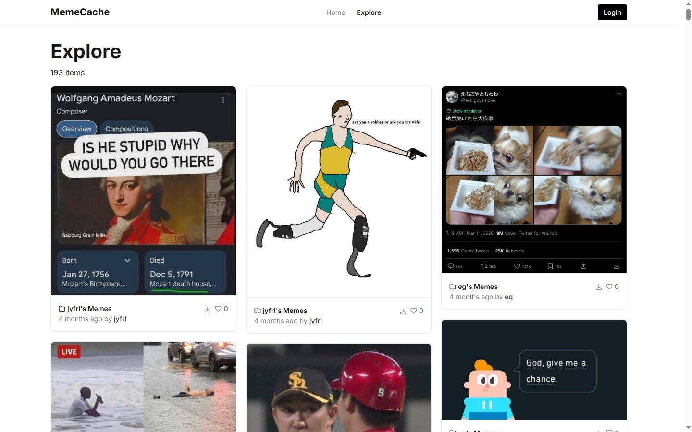

# MemeCache

A personal **meme library** — upload, tag, transcribe, and search the memes you collect, so you can actually find the right one again. Invite-only.

🔗 **Live:** [memecache.me](https://memecache.me)



## What it does

- **Upload & organize** — drop in memes; images are compressed on upload and stored in S3.
- **Transcription** — memes carry their text, so the raw material for searching by what they *say* is there.
- **Tags** — tag memes and browse by tag (`/t/…`) to make a big collection searchable.
- **Explore & Library** — an Explore feed of shared memes and your own personal Library.
- **Accounts** — registration and login, gated behind a shared access code.

Search itself is not built yet, and it is the main gap — the transcriptions and tags are
the inputs to it. See [`TODO.md`](TODO.md), Phase 9a. Contribution scoring is likewise
planned rather than built.

## Tech stack

| | |
|---|---|
| Framework | Next.js 14 (App Router) + React 18 |
| UI | React-Bootstrap + Sass, masonry layout |
| Auth | bcrypt + JWT (`jose`), no framework |
| Database | Postgres via `pg` |
| Storage | AWS S3 (`@aws-sdk/client-s3`) |
| Images | client-side compression (`browser-image-compression`) |

## Setup

Requires Node 20 or newer and Docker.

```bash
npm install
cp .env.example .env    # defaults point at the local stack
npm run dev:up          # Postgres 17 on :5433, SeaweedFS (S3) on :8333
npm run db:seed         # schema, migrations, sample data
npm run dev             # http://localhost:3000
```

Every seeded account's password is `password`, and emails are `<username>@example.test`.
The registration code is `local`.

Without a sample, `db:seed` creates two empty users (`alice`, `bob`). To get real memes,
run `npm run db:pull-sample` once first. It SSHes to the Dallas box (the `dallas` host
alias), picks about 30 well-tagged memes and copies them with their tags, votes, likes and
transcriptions into `db/seed/sample/`. It only reads from production, never copies emails or
password hashes, and production credentials stay on the box. The sample is gitignored
because it holds real memes and usernames.

`db:seed` wipes and rebuilds the local database every time, and refuses to run unless
`DATABASE_URL` and `MC_S3_ENDPOINT` both point at localhost.

Configuration lives in `.env` (not `.env.local`). `.env.example` lists every variable with
notes on what each is for. Production values only exist on the Dallas box.

## Scripts

| Command | What it does |
|---|---|
| `npm run dev` | Development server |
| `npm run build` | Production build |
| `npm run start` | Serve a production build |
| `npm run lint` | ESLint |
| `npm run typecheck` | `tsc --noEmit` |
| `npm test` | Vitest against a fresh `memecache_test` database (needs `npm run dev:up`) |
| `npm run db:migrate` | Apply pending migrations |
| `npm run db:migrate:status` | List applied and pending migrations |
| `npm run db:migrate:dry` | Print the SQL that would run, change nothing |
| `npm run dev:up` / `dev:down` | Start or stop the local Postgres and S3 containers |
| `npm run db:seed` | Rebuild the local database and bucket from the schema and the sample |
| `npm run db:pull-sample` | Copy a small read-only sample of production into `db/seed/sample/` |

## Layout

```
src/app/          routes; api/ holds the route handlers
src/auth/         lib.ts is server-only helpers, actions.ts is the three form actions
src/components/   shared UI
src/db/queries/   every SQL query, as typed functions; nothing else touches the database
src/db/db.ts      the connection pool and the query helper the queries use
tests/            Vitest tests for the queries, against a local test database
src/util/s3/      object storage
db/               schema, migrations, backups, and notes on all three
```

Two invariants worth knowing before changing anything under `src/`:

**Every API route goes through `route()` in `src/server/route.ts`.** It resolves the
session user, validates the JSON body with zod, and returns errors as `{ error }`. The
client calls routes with `api()` from `src/util/api.ts`. Writes are route handlers, not
server actions; see `docs/architecture-plan.md` step 4 for why.

**Identity always comes from the session.** The `route()` wrapper hands each handler the
user from the access token. No endpoint accepts a `userId` from the
request body; if you add one that does, that is a bug.

**`src/auth/lib.ts` deliberately does not carry `'use server'`.** That directive turns every
export in a file into a publicly callable endpoint, which is why the login, register and
logout actions live alone in `src/auth/actions.ts`. Nothing else belongs in that file.

## Database

Schema, migrations, known schema problems, and backup notes are in
[`db/README.md`](db/README.md). The runbook for moving off Neon onto self-hosted Postgres
is [`db/MIGRATION.md`](db/MIGRATION.md).

To add a migration, drop a `NNN_name.sql` file in `db/migrations/` and run
`npm run db:migrate`. Each file runs once, inside a transaction, tracked in a `_migration`
table.

## Status

In active use (invite-only). [`TODO.md`](TODO.md) is the working plan — ordered
deliberately, since the phases have dependencies. Runs on a self-hosted VPS with
self-hosted Postgres; the move off Neon and Vercel is done.
